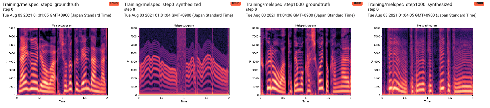
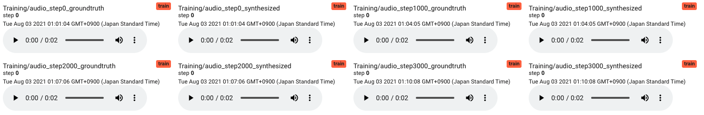

# Simplified Neural Source Filter Model

My implementation of simplified neural source filter model (S-NSF) in [this paper](https://arxiv.org/abs/1904.12088) with some modifications.  
I examined this implementation on [JSUT Corpus](https://arxiv.org/abs/1711.00354) (a single-speaker Japanese speech corpus) and [JVS Corpus](https://arxiv.org/abs/1908.06248) (a multi-speaker Japanese speech corpus).  
You can find some training results (around 700k iteration) from [here](./results/).


## Updates
- 2021/08/04: Initial commit

## Usage
First, install dependencies with
```
$pip install -r requirements.txt
```

You can explore various training parameters by editing `config.yaml`.

### Preprocessing
```
$python preprocess.py
```

### Start training
```
$python train.py
```

### Visualize results
```
$tensorboard --logdir=${log_path}
```





## References
- [Neural source-filter waveform models for statistical parametric speech synthesis](https://arxiv.org/abs/1904.12088)
- [JSUT corpus: free large-scale Japanese speech corpus for end-to-end speech synthesis](https://arxiv.org/abs/1711.00354)
- [JVS corpus: free Japanese multi-speaker voice corpus](https://arxiv.org/abs/1908.06248)
